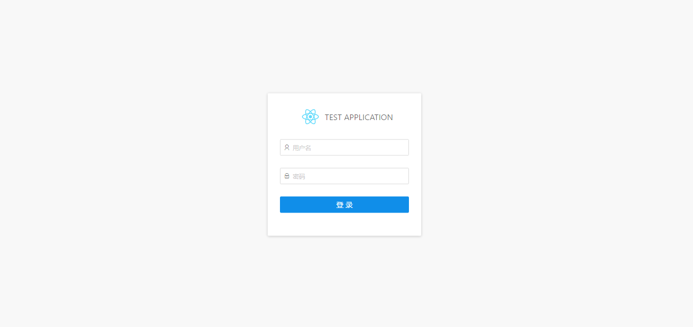
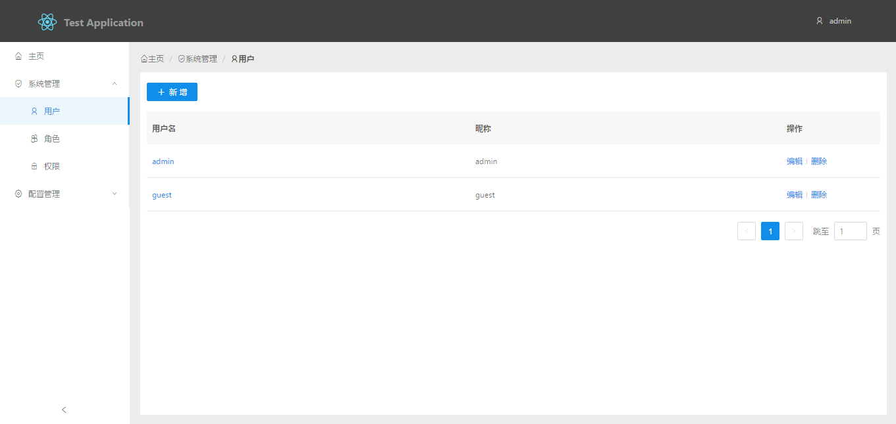

# rmm

一个管理/后台系统模板，使用：

* [react](https://facebook.github.io/react/)
* [ant-design](https://ant.design/)
* [dva](https://github.com/dvajs/dva)
* [roadhog](https://github.com/sorrycc/roadhog)

## 使用

```
npm install
npm run start

npm run build
```

## 截图






